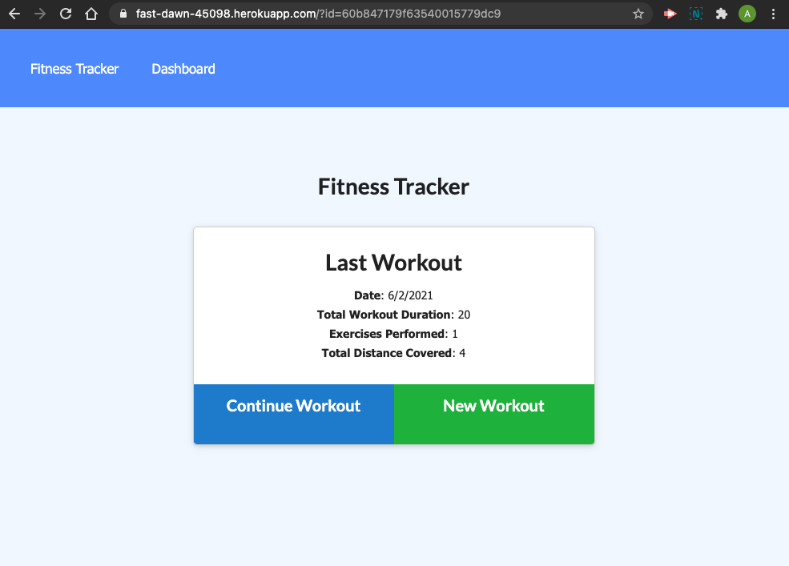
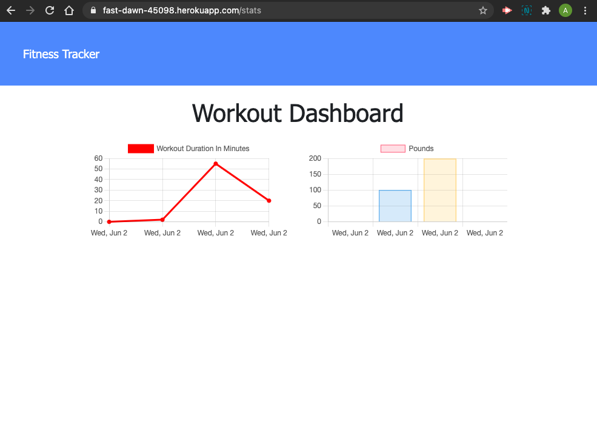

# NoSQL: Fitness Tracker

## Description
    This Fitness Tracker application allows users to track their workouts with ease 
    The user is able to add workouts based on the workout type and the amounts of sets,
    reps and lenght of training.

## Story
    A user is able to view create and track daily workouts. The user can log multiple exercises 
    in a workout on any given day. The user is also be able to track the name, type, weight, sets, 
    reps, and the duration of the exercise. If the exercise is a cardio exercise, the user is able 
    to track the distance they traveled.

## License

## Deployment
[Progressive Budget Tracker ](https://fast-dawn-45098.herokuapp.com/)
This app is deployed live on Heroku!! (Click Link!)

## Demo

